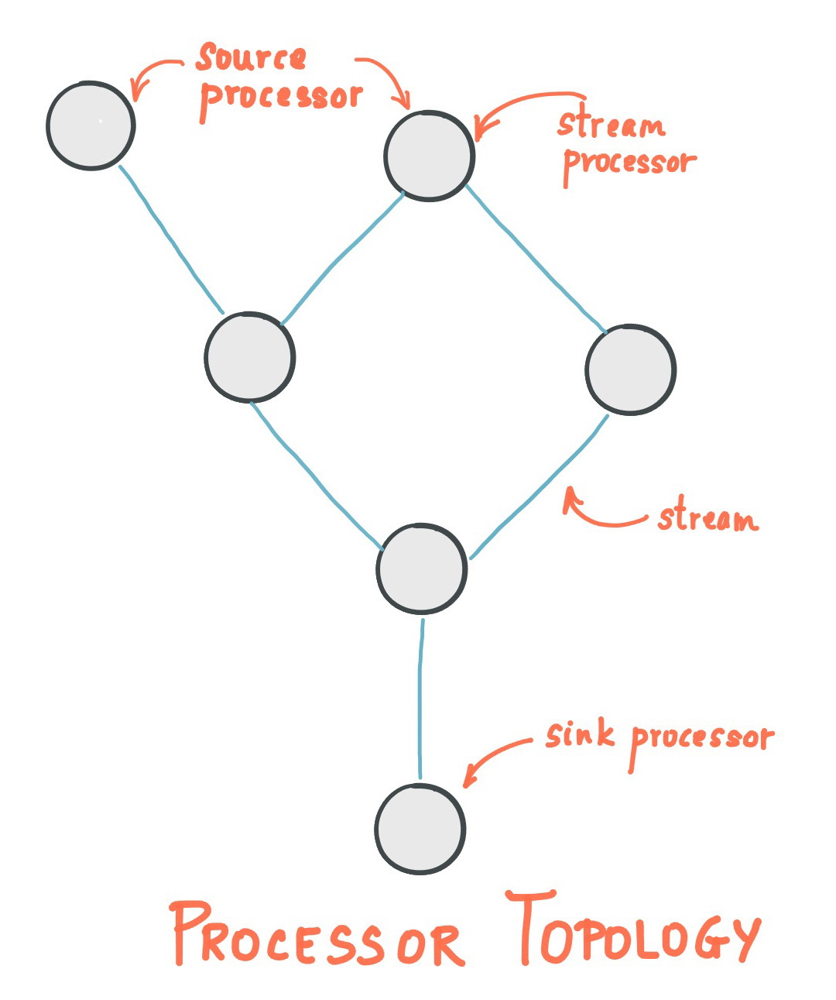

# Word Count Application
A simple application is used to demonstrate how Kafka Streams works.

## Core Concepts

### Topology


1. A ```stream``` is a sequence of immutable data records, that fully ordered, can be replayable and is fault-tolerant, where a data record is defined as a key-value pair.
We can consider Kafka Topic as a stream.

2. A ```stream processor``` is a node in the processor topology. It transforms incoming streams, record by record, and may create a new stream from it.
It could be ```consumer``` and ```producer```.
    1. ```source processor```: A source processor is a special type of stream processor that does not have any upstream processors.
    2. ```sink processor```: A sink processor is a special type of stream processor that does not have down-stream processors.

## Internal Topics
- Running a kafka streams application may eventually create internal intermediary topics
    1. ```Repartitioning topics```: transforming the key of your stream, a repartitioning will happen at some processor.
    2. ```Changelog topics```: saving the result data of aggregations in these topics.

- Properties:
    - Managed by Kafka Streams
    - Used by Kafka Streams to save/ restore state and repartition data
    - Prefixed by application.id (groupId)
    - __Should never be deleted, altered or published, they are internal__
    
## Prerequisite
1. Java 8
2. Maven

## Lambda function
1. Lambda: https://www.w3schools.com/java/java_lambda.asp
2. Method reference: https://www.geeksforgeeks.org/double-colon-operator-in-java/
    - Nếu một lambda expression xử lý một phương thức như một object thì method references xử lý một method như một lambda.
    - Method reference có 2 ưu điểm so với lambda expression. Đầu tiên là ngắn gọn và thứ hai là nó bao gồm tên của class bao gồm method đó. Cả hai điều này làm cho code dễ đọc hơn.
    
## Packaging
- Default compilation in java only includes the code you write in the .jar file, without the dependencies.
- Maven has a plugin to allow us to package all your code + the dependencies into one jar, called the __fat jar__.

## Demo
1. Run commands in ```kafka-streams-commands``` directory.
2. Run app

## Scaling
- Just run multiple instances of stream processor application.
