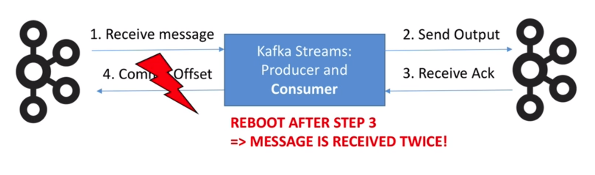

# Exactly One Semantics

- Exactly once is the ability to guarantee that __data processing on each message will happen only once__, and that __pushing the message back to Kafka will also happen effectively only once__

- Guaranteed when __both input and output system is Kafka__, not for Kafka to any external systems.

- Exactly Once Semantics if Kafka version >= 0.11

#
## "At Least Once" Problem

- Problem 1: Consumer can not commit

    
    - If the Broker reboots or Consumer restarts, the consumer receive twice the same message.

    - Offsets are committed once in a while, but the data may have been processed already.

- Problem 2: Producer does not receive Ack

    
    - It may mean that the network just failed, instead of Kafka
    - Kafka may send twice the same message

## Solving problem
- Producers are now idempotent. If the same message is sent twice or more due to retries, Kafka will make sure to only keep once copy of it.

- You can write multiple messages to different Kafka topics as part of one transaction. (either all are written or none is written).

## How to do exactly once
```
Properties props = new Properties();
...
props.put(StreamsConfig.PROCESSING_GUARENTEE_CONFIG, StreamsConfig.EXACTLY_ONCE);
...
KafkaStreams streams = new KafkaStreams(builder, props);
```

- Trade-off:
    - Results are published in transactions, which might incur a small latency
    - You fine tune that setting using commit.interval.ms

#
## References
1. https://www.youtube.com/watch?v=Wo9jlaz8h0k
2. https://medium.com/@jaykreps/exactly-once-support-in-apache-kafka-55e1fdd0a35f
3. https://techcrunch.com/2017/06/30/confluent-achieves-holy-grail-of-exactly-once-delivery-on-kafka-messaging-service/