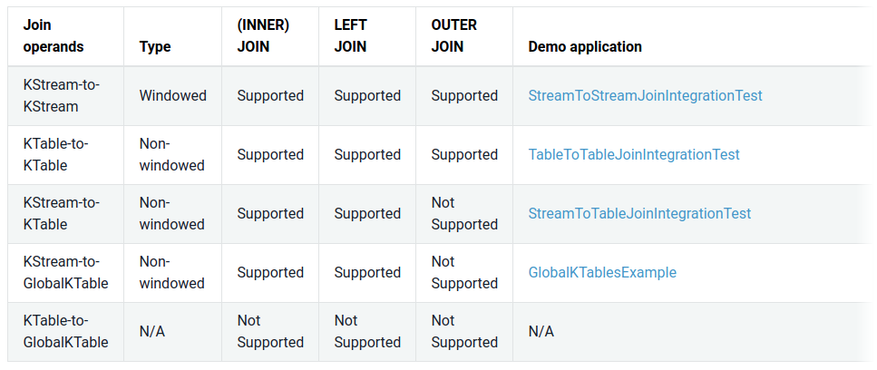
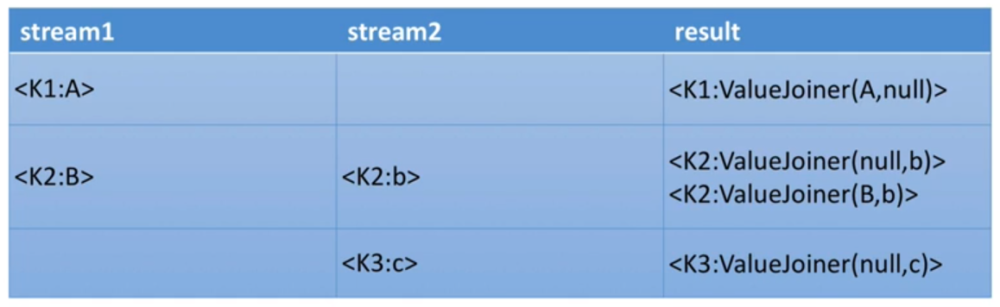

# Joins

## Definition

- Joining means taking a KStream and / or KTable and creating a new KStream or KTable from it.

- Join Operations:

## Co-partitioning of Data
- Input data must be co-partitioned when joining. This ensures that __input records with the same key, from both sides of the join, are delivered to the same stream task during processing. It is the responsibility of the user to ensure data co-partitioning when joining.__ Otherwise, the join won't be doable and Kafka Streams will fail with a Runtime Error.

- Requirements:
     - Same number of partitions.
     - The input topics must have the same partitioning strategy so that records with the same key are delivered to same partition number.

     - To co-partition data, if the number of partitions is different, write back the topics through Kafka before the join. __This has a network cost__.

## GlobalKTable
- Data of GlobalKTables lives on every Streams instances.
- With GlobalKTables, you can join any stream to your table even if the data does not have the same number of partition.
- Downside: Size on disk. If __your data is huge, it is a problem.__

## Join Types
- (Inner) Join: Emits an output when both input sources have records with the same key.
- Left Join
- Outer Join:
     - Only available for KStream / KStream joins
     - Emits an output for each record in either input source. 
     - It's a left join combined with a right join

     

